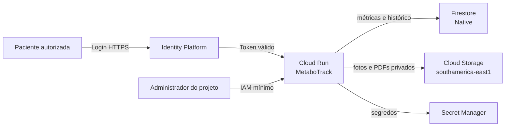

# Plano de implantação segura no Google Cloud

## Objetivo

Disponibilizar o MetaboTrack on-line para a paciente atual, com dados persistentes, acesso autenticado e custo operacional baixo. A primeira publicação será regional em **`southamerica-east1` (São Paulo)**.

## Decisões de arquitetura

| Necessidade | Serviço | Decisão inicial |
| --- | --- | --- |
| Dashboard web | Cloud Run | Streamlit em container, escala para zero e máximo de uma instância. |
| Identidade da usuária | Identity Platform | Login por e-mail e senha; somente contas autorizadas poderão abrir o dashboard. |
| Métricas, avaliações e metadados | Cloud Firestore, modo Native | Um documento por paciente e coleções para medidas, exames e fotos. |
| PDFs e fotos | Cloud Storage | Bucket privado na mesma região, com acesso somente pela conta de serviço do Cloud Run. |
| Senhas e configuração sensível | Secret Manager | Segredos fora do Git e fora das variáveis de desenvolvimento. |
| Análises futuras | BigQuery | Fora da primeira versão. Só será incluído para relatórios agregados de múltiplos pacientes. |

O Cloud Run será publicado com acesso de rede público apenas para carregar a tela de login. A aplicação não mostrará dados nem aceitará inclusões até validar o token da Identity Platform. O bucket e o Firestore não receberão permissões de acesso direto da paciente.

## Proteções mínimas

1. **Autenticação obrigatória:** login por e-mail e senha via Identity Platform, com uma lista de e-mails permitidos inicialmente.
2. **Autorização no aplicativo:** cada acesso validará o token e a autorização da pessoa para o perfil da paciente antes de carregar qualquer dado.
3. **Dados privados:** fotos e laudos não terão URL pública. O Cloud Run os recuperará usando uma conta de serviço própria.
4. **IAM de privilégio mínimo:** a conta do Cloud Run terá somente acesso de leitura e escrita ao bucket do MetaboTrack, às coleções Firestore necessárias e ao segredo de configuração.
5. **Segredos protegidos:** chaves, configuração de login e valores sensíveis ficarão no Secret Manager. Nenhum segredo será enviado ao Git.
6. **Transporte e armazenamento:** usar HTTPS do Cloud Run; Firestore, Cloud Storage e Secret Manager já aplicam criptografia gerenciada pelo Google em repouso.
7. **Registro responsável:** logs terão eventos técnicos e falhas, mas não valores de medidas, texto de laudos, fotos ou tokens.
8. **Limite de acesso:** máximo de uma instância e concorrência `1` na primeira versão, adequado ao uso individual e evitando conflitos de gravação.

## Ajustes necessários no código

### 1. Persistência em nuvem

- Criar uma camada de repositório para substituir a dependência direta do SQLite em produção.
- Manter SQLite e a pasta `data/` como modo local de desenvolvimento.
- Salvar exames confirmados, medidas e metadados de fotos no Firestore.
- Salvar arquivos originais em prefixos privados no bucket, por exemplo `patients/{patient_id}/photos/` e `patients/{patient_id}/exams/`.
- Migrar os dados existentes da Maria Helena uma única vez, com conferência de quantidade de registros e arquivos após a importação.

### 2. Login e autorização

- Inserir uma tela de autenticação antes do dashboard.
- Validar tokens da Identity Platform no servidor.
- Criar uma coleção `authorized_users` com os e-mails autorizados e o papel inicial `patient`.
- Encerrar a sessão local após período de inatividade e oferecer botão de sair.

### 3. Containerização

- Criar `Dockerfile` Linux com Python, Streamlit, Poppler e Tesseract para manter a extração convencional e o OCR.
- Fazer o Streamlit atender em `0.0.0.0:$PORT`, exigência do Cloud Run.
- Adicionar `.dockerignore` para excluir `.venv`, `data/`, fotos, PDFs, saídas e arquivos locais de desenvolvimento.
- Definir recursos iniciais de `1 vCPU`, `1 GiB` de memória, timeout de até cinco minutos para PDFs com OCR, escala mínima `0` e máxima `1`.

### 4. Configuração por ambiente

| Variável | Uso |
| --- | --- |
| `APP_ENV` | Seleciona modo local ou GCP. |
| `GCP_PROJECT_ID` | Projeto `metabotrack-509620`. |
| `GCP_REGION` | `southamerica-east1`. |
| `METABOTRACK_BUCKET` | Bucket privado de fotos e laudos. |
| `FIRESTORE_DATABASE` | Banco Native da aplicação. |
| `IDENTITY_PLATFORM_API_KEY` | Configuração pública do cliente de login. |

Valores confidenciais não devem ser colocados em arquivos versionados. A conta de serviço em Cloud Run deve usar credenciais de ambiente, sem chave JSON baixada.

## Recursos GCP a criar

1. Confirmar cobrança e definir orçamento mensal com alerta em 50%, 80% e 100%.
2. Habilitar as APIs: Cloud Run, Cloud Build, Artifact Registry, Firestore, Cloud Storage, Secret Manager e Identity Toolkit.
3. Criar bucket regional privado em `southamerica-east1`, com Uniform Bucket-Level Access, acesso público bloqueado e regra de ciclo de vida para arquivos excluídos.
4. Criar banco Cloud Firestore Native na região selecionada antes de qualquer gravação de dados.
5. Criar conta de serviço `metabotrack-run` e conceder as permissões mínimas nos recursos específicos.
6. Criar segredos no Secret Manager e dar a essa conta somente permissão de leitura das versões necessárias.
7. Configurar Identity Platform com o provedor e-mail/senha e cadastrar apenas os usuários autorizados.
8. Criar repositório Artifact Registry em `southamerica-east1` para as imagens do container.
9. Criar o serviço Cloud Run com a conta de serviço dedicada e a configuração de escala definida acima.

## Fases de entrega

### Fase 1 — Preparar e proteger o código

- Implementar repositórios Firestore e Cloud Storage.
- Implementar login, autorização e encerramento de sessão.
- Criar Dockerfile, `.dockerignore` e configuração de deploy.
- Testar o modo local sem exigir credenciais GCP.

**Critério de aceite:** o dashboard funciona localmente com o novo modo de persistência simulado e nenhum segredo entra no repositório.

### Fase 2 — Provisionar recursos

- Criar os recursos listados no projeto `metabotrack-509620`.
- Aplicar IAM, orçamento e alertas.
- Criar uma conta de teste autorizada no Identity Platform.

**Critério de aceite:** apenas a conta de serviço consegue ler o bucket e apenas a conta de teste consegue ultrapassar a tela de login.

### Fase 3 — Migrar e validar os dados atuais

- Importar os dois exames, as medidas e as fotos já existentes.
- Conferir contagens, datas, direções e uma comparação de fotos.
- Validar a extração de PDF e a revisão humana em ambiente de homologação.

**Critério de aceite:** o dashboard em nuvem apresenta os mesmos indicadores, gráficos e fotos da versão local.

### Fase 4 — Publicar

- Fazer o deploy no Cloud Run em `southamerica-east1`.
- Testar login, carregamento, inclusão de exame, inclusão de foto e persistência após reinício da instância.
- Registrar URL, procedimento de recuperação e rotina mensal de revisão de custos.

**Critério de aceite:** a paciente acessa somente o próprio painel via HTTPS e os dados continuam disponíveis após escala para zero e novo acesso.

## Custos e operação

`southamerica-east1` prioriza acesso no Brasil e residência regional, mas pertence à faixa de preço regional superior do Cloud Run. Para este uso individual, escala para zero e ausência de instâncias mínimas evitam cobrança em períodos ociosos; o custo principal tende a ser armazenamento de fotos/PDFs e tráfego de saída.

BigQuery não será usado nesta etapa porque o Firestore atende as leituras e gravações transacionais do dashboard. Ele será avaliado quando houver vários pacientes, relatórios agregados anonimizados ou necessidade de análises históricas mais complexas.

## Referências

- [Cloud Run: filesystem descartável e persistência externa](https://cloud.google.com/run/docs/overview/what-is-cloud-run)
- [Cloud Run: preços e faixas regionais](https://cloud.google.com/run/pricing)
- [Cloud Run e autenticação de usuários finais](https://cloud.google.com/run/docs/tutorials/identity-platform)
- [Cloud Storage: Uniform Bucket-Level Access](https://cloud.google.com/storage/docs/uniform-bucket-level-access)
- [Secret Manager: boas práticas](https://cloud.google.com/secret-manager/docs/best-practices)
